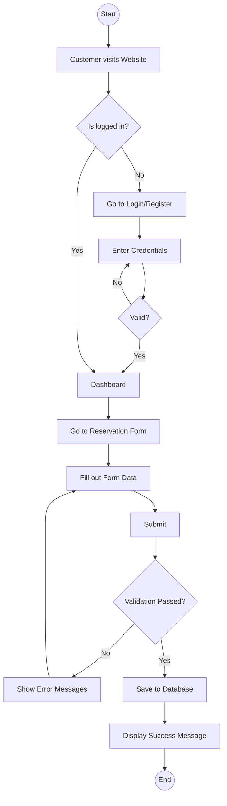

# Urban Spoon — Activity Diagram (Booking Process)

This flowchart illustrates the step-by-step activity of booking a table.

```mermaid
flowchart TD
    Start((Start)) --> A[Customer visits Website]
    A --> B{Is logged in?}
    
    B -- No --> C[Go to Login/Register]
    C --> D[Enter Credentials]
    D --> E{Valid?}
    E -- No --> D
    E -- Yes --> F[Dashboard]
    
    B -- Yes --> F
    
    F --> G[Go to Reservation Form]
    G --> H[Fill out Form Data]
    H --> I[Submit]
    
    I --> J{Validation Passed?}
    J -- No --> K[Show Error Messages]
    K --> H
    
    J -- Yes --> L[Save to Database]
    L --> M[Display Success Message]
    M --> End((End))
```
