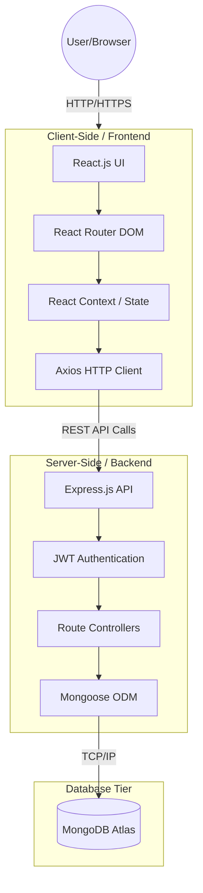

# Urban Spoon — System Architecture

This document illustrates the high-level architecture of the Urban Spoon application. It follows a standard MERN stack structure (MongoDB, Express.js, React, Node.js).

## Architecture Diagram

## Description
- **Frontend**: Built with React and Vite. It handles routing, user interface state, and HTTP requests via Axios.
- **Backend**: Built with Node.js and Express. Handles API endpoints, user authentication (JWT), business logic, and interacts with the database.
- **Database**: MongoDB Atlas is used for scalable, cloud-based data storage, connected via Mongoose for schema definitions.
