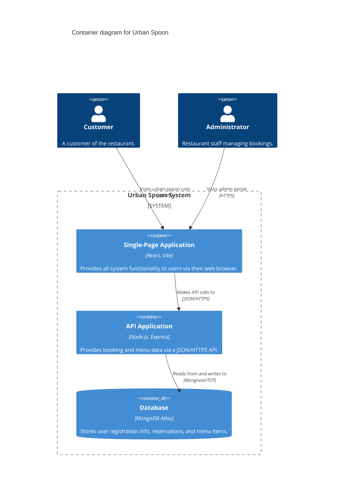

# Urban Spoon — C4 Model (Container)

The C4 Container diagram zooms into the system to show the high-level technical building blocks.

```mermaid
C4Container
    title Container diagram for Urban Spoon
    
    Person(customer, "Customer", "A customer of the restaurant.")
    Person(admin, "Administrator", "Restaurant staff managing bookings.")
    
    System_Boundary(c1, "Urban Spoon System") {
        Container(spa, "Single-Page Application", "React, Vite", "Provides all system functionality to users via their web browser.")
        Container(api, "API Application", "Node.js, Express", "Provides booking and menu data via a JSON/HTTPS API.")
        ContainerDb(db, "Database", "MongoDB Atlas", "Stores user registration info, reservations, and menu items.")
    }
    
    Rel(customer, spa, "Visits urban-spoon.com", "HTTPS")
    Rel(admin, spa, "Visits admin portal", "HTTPS")
    
    Rel(spa, api, "Makes API calls to", "JSON/HTTPS")
    Rel(api, db, "Reads from and writes to", "Mongoose/TCP")
```
