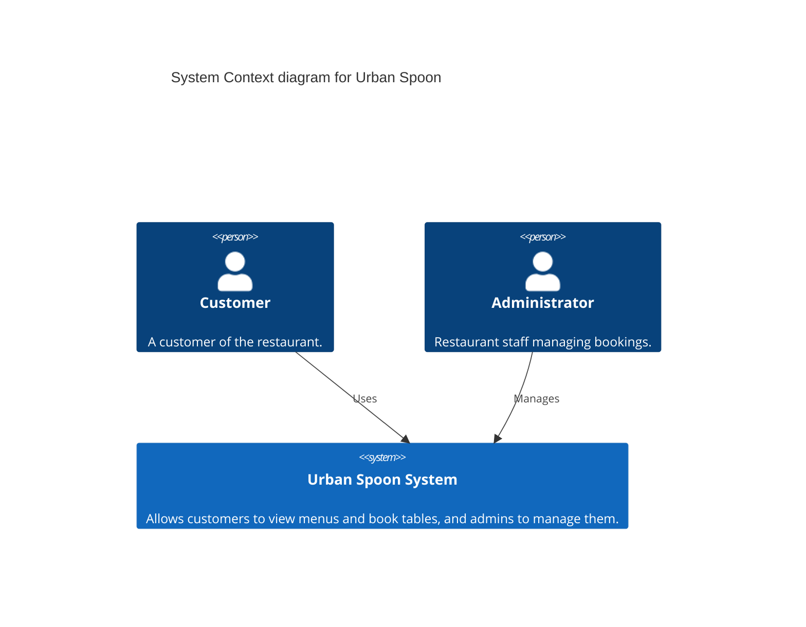

# Urban Spoon — C4 Model (Context)

The C4 Context diagram shows the big picture of the software system.

```mermaid
C4Context
    title System Context diagram for Urban Spoon
    
    Person(customer, "Customer", "A customer of the restaurant.")
    Person(admin, "Administrator", "Restaurant staff managing bookings.")
    
    System(urbanSpoon, "Urban Spoon System", "Allows customers to view menus and book tables, and admins to manage them.")
    
    Rel(customer, urbanSpoon, "Uses")
    Rel(admin, urbanSpoon, "Manages")
```
