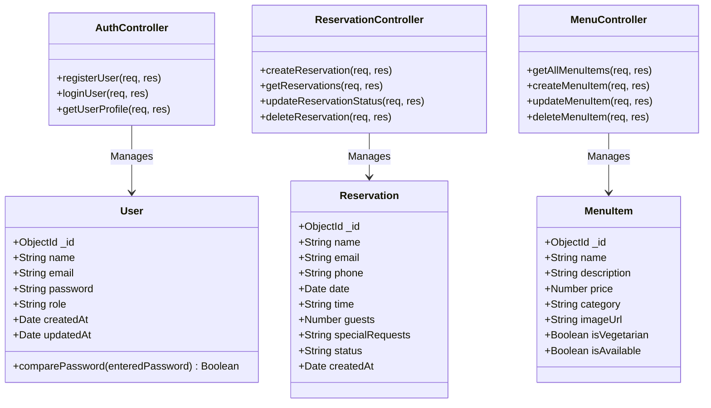

# Urban Spoon — Class Diagram

This diagram represents the core data structures and controllers in the backend API.

```mermaid
classDiagram
    class User {
        +ObjectId _id
        +String name
        +String email
        +String password
        +String role
        +Date createdAt
        +Date updatedAt
        +comparePassword(enteredPassword) Boolean
    }

    class Reservation {
        +ObjectId _id
        +String name
        +String email
        +String phone
        +Date date
        +String time
        +Number guests
        +String specialRequests
        +String status
        +Date createdAt
    }

    class MenuItem {
        +ObjectId _id
        +String name
        +String description
        +Number price
        +String category
        +String imageUrl
        +Boolean isVegetarian
        +Boolean isAvailable
    }

    class AuthController {
        +registerUser(req, res)
        +loginUser(req, res)
        +getUserProfile(req, res)
    }

    class ReservationController {
        +createReservation(req, res)
        +getReservations(req, res)
        +updateReservationStatus(req, res)
        +deleteReservation(req, res)
    }

    class MenuController {
        +getAllMenuItems(req, res)
        +createMenuItem(req, res)
        +updateMenuItem(req, res)
        +deleteMenuItem(req, res)
    }

    AuthController --> User : Manages
    ReservationController --> Reservation : Manages
    MenuController --> MenuItem : Manages
```
