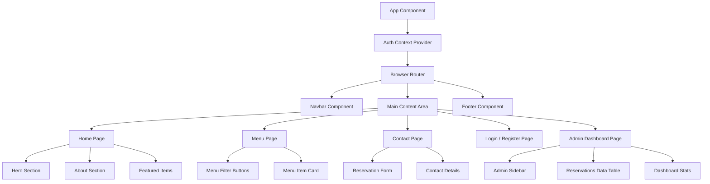

# Urban Spoon — Component Diagram

This diagram visualizes the React frontend component hierarchy and how different UI pieces are composed together.

## Description
- The application is wrapped in an **Auth Context** for global state management regarding user logins.
- The **Navbar** and **Footer** are persistent across pages.
- The **Admin Dashboard** is protected and only renders if the user is authenticated as an admin.
