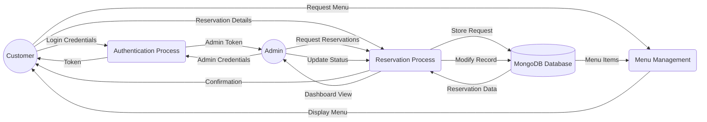

# Urban Spoon — Data Flow Diagram (DFD)

This diagram illustrates how data flows through the Urban Spoon system, particularly focusing on the reservation and authentication processes.

## Level 1 Data Flow

## Description
- **Authentication**: Users and Admins send credentials to get a JWT token.
- **Reservations**: Customers submit reservation details, which are processed and stored in the database. Admins retrieve and manage these records.
- **Menu**: Customers request the menu, which is fetched from the database and displayed.
