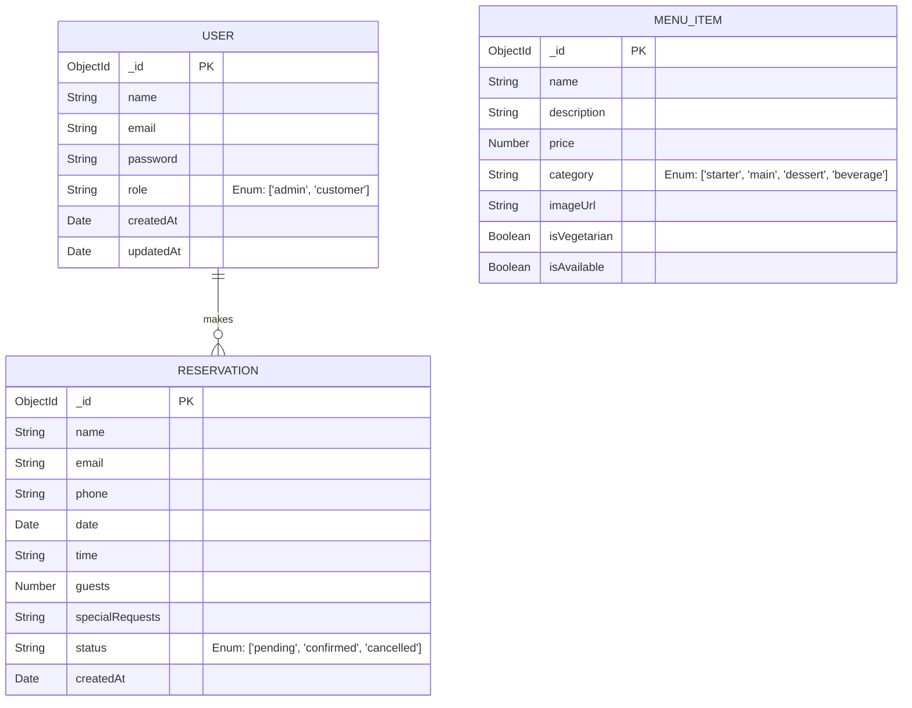

# Urban Spoon — Entity-Relationship Diagram (ERD)

This diagram shows the conceptual database schema and relationships for the application, representing the MongoDB collections.

## Description
- **USER**: Stores both admin and customer credentials. Roles distinguish access levels.
- **RESERVATION**: Stores table booking details. Tied conceptually to a user if logged in, but can also be made by guest users.
- **MENU_ITEM**: Stores the catalogue of dishes available in the restaurant.
