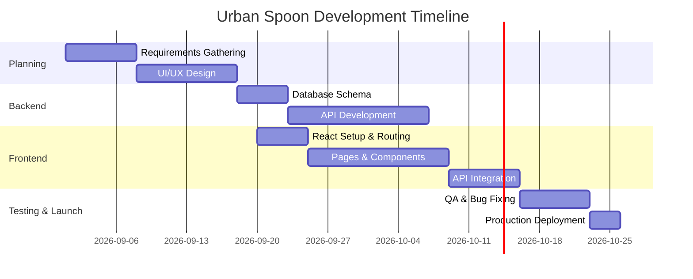

# Urban Spoon — Project Gantt Chart

This chart illustrates a typical development lifecycle and timeline for building this application.

```mermaid
gantt
    title Urban Spoon Development Timeline
    dateFormat  YYYY-MM-DD
    section Planning
    Requirements Gathering   :a1, 2026-09-01, 7d
    UI/UX Design            :a2, 2026-09-08, 10d
    section Backend
    Database Schema         :b1, 2026-09-18, 5d
    API Development         :b2, 2026-09-23, 14d
    section Frontend
    React Setup & Routing   :c1, 2026-09-20, 5d
    Pages & Components      :c2, 2026-09-25, 14d
    API Integration         :c3, 2026-10-09, 7d
    section Testing & Launch
    QA & Bug Fixing         :d1, 2026-10-16, 7d
    Production Deployment   :d2, 2026-10-23, 3d
```
