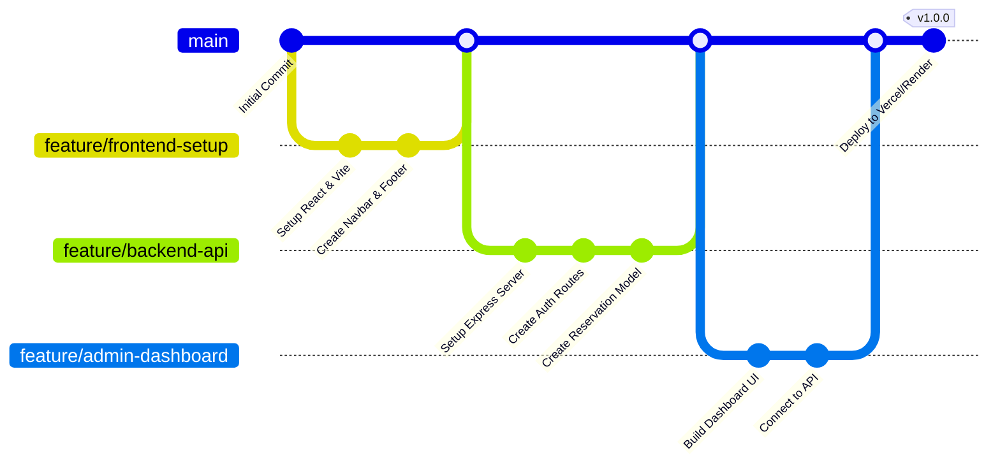

# Urban Spoon — Git Branching Strategy

This git graph shows the standard workflow for version control used during development.

```mermaid
gitGraph
    commit id: "Initial Commit"
    branch feature/frontend-setup
    checkout feature/frontend-setup
    commit id: "Setup React & Vite"
    commit id: "Create Navbar & Footer"
    checkout main
    merge feature/frontend-setup
    
    branch feature/backend-api
    checkout feature/backend-api
    commit id: "Setup Express Server"
    commit id: "Create Auth Routes"
    commit id: "Create Reservation Model"
    checkout main
    merge feature/backend-api
    
    branch feature/admin-dashboard
    checkout feature/admin-dashboard
    commit id: "Build Dashboard UI"
    commit id: "Connect to API"
    checkout main
    merge feature/admin-dashboard
    
    commit id: "Deploy to Vercel/Render" tag: "v1.0.0"
```
