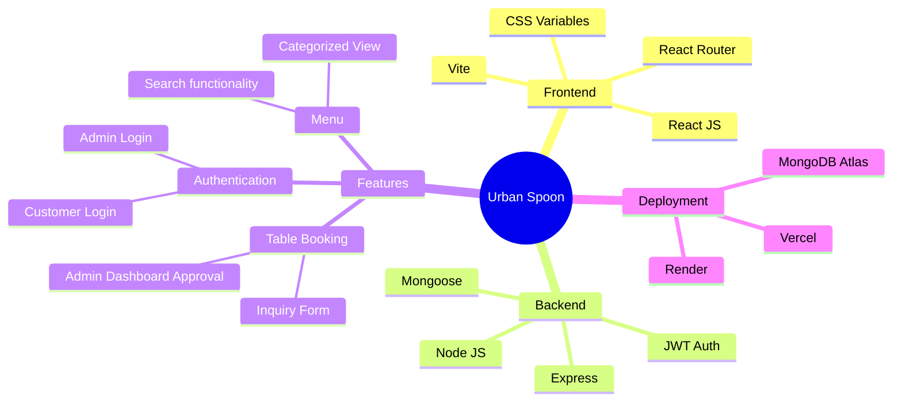

# Urban Spoon — Feature Mindmap

A high-level breakdown of the application features.

```mermaid
mindmap
  root((Urban Spoon))
    Frontend
      React JS
      Vite
      CSS Variables
      React Router
    Backend
      Node JS
      Express
      Mongoose
      JWT Auth
    Features
      Authentication
        Admin Login
        Customer Login
      Table Booking
        Inquiry Form
        Admin Dashboard Approval
      Menu
        Categorized View
        Search functionality
    Deployment
      Vercel
      Render
      MongoDB Atlas
```
