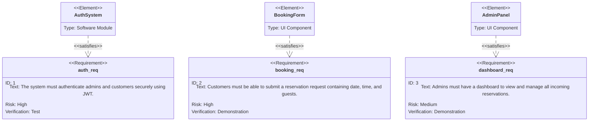

# Urban Spoon — System Requirements Diagram

This diagram maps out the core functional requirements for the application.

```mermaid
requirementDiagram
    requirement auth_req {
        id: 1
        text: "The system must authenticate admins and customers securely using JWT."
        risk: high
        verifymethod: test
    }
    
    requirement booking_req {
        id: 2
        text: "Customers must be able to submit a reservation request containing date, time, and guests."
        risk: high
        verifymethod: demonstration
    }
    
    requirement dashboard_req {
        id: 3
        text: "Admins must have a dashboard to view and manage all incoming reservations."
        risk: medium
        verifymethod: demonstration
    }
    
    element AuthSystem {
        type: "Software Module"
    }
    
    element BookingForm {
        type: "UI Component"
    }
    
    element AdminPanel {
        type: "UI Component"
    }
    
    AuthSystem - satisfies -> auth_req
    BookingForm - satisfies -> booking_req
    AdminPanel - satisfies -> dashboard_req
```
