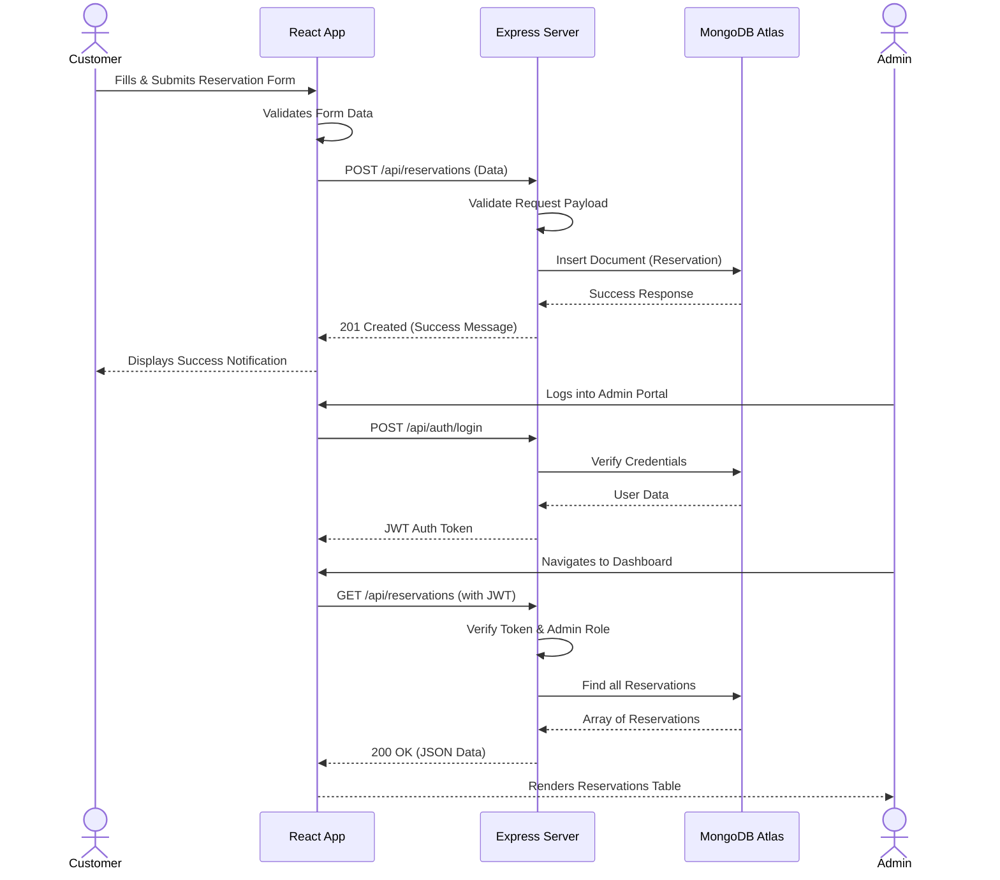

# Urban Spoon — Sequence Diagram

This sequence diagram details the step-by-step process of a customer making a table reservation, and an admin later viewing it.

## Table Reservation Sequence

```mermaid
sequenceDiagram
    actor Customer
    participant Frontend as React App
    participant API as Express Server
    participant DB as MongoDB Atlas
    actor Admin

    %% Customer making a reservation
    Customer->>Frontend: Fills & Submits Reservation Form
    Frontend->>Frontend: Validates Form Data
    Frontend->>API: POST /api/reservations (Data)
    API->>API: Validate Request Payload
    API->>DB: Insert Document (Reservation)
    DB-->>API: Success Response
    API-->>Frontend: 201 Created (Success Message)
    Frontend-->>Customer: Displays Success Notification
    
    %% Admin viewing reservations
    Admin->>Frontend: Logs into Admin Portal
    Frontend->>API: POST /api/auth/login
    API->>DB: Verify Credentials
    DB-->>API: User Data
    API-->>Frontend: JWT Auth Token
    
    Admin->>Frontend: Navigates to Dashboard
    Frontend->>API: GET /api/reservations (with JWT)
    API->>API: Verify Token & Admin Role
    API->>DB: Find all Reservations
    DB-->>API: Array of Reservations
    API-->>Frontend: 200 OK (JSON Data)
    Frontend-->>Admin: Renders Reservations Table
```
