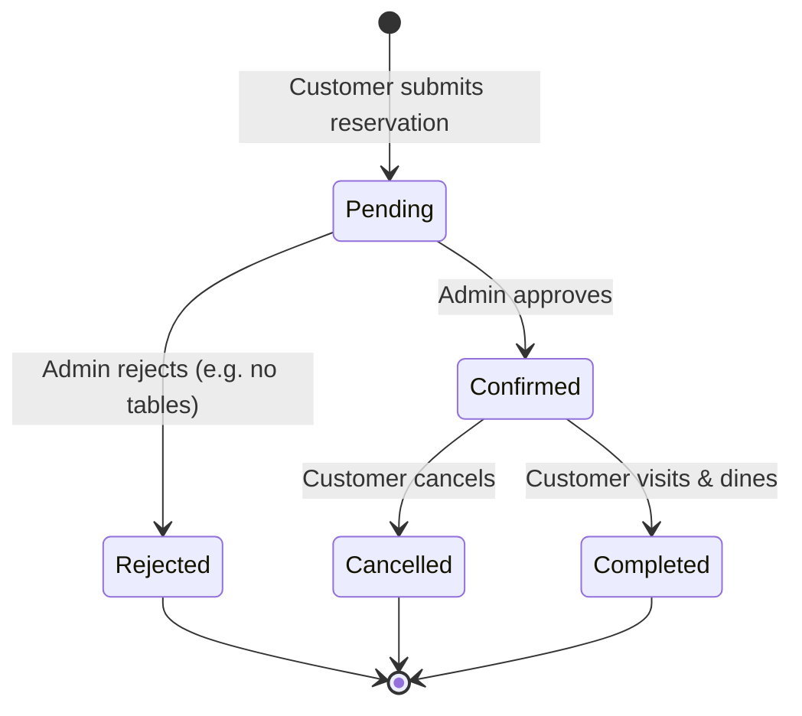

# Urban Spoon — State Diagram (Reservation Lifecycle)

This diagram shows the various states a Table Reservation can go through in the system.

```mermaid
stateDiagram-v2
    [*] --> Pending : Customer submits reservation

    Pending --> Confirmed : Admin approves
    Pending --> Rejected : Admin rejects (e.g. no tables)
    
    Confirmed --> Cancelled : Customer cancels
    Confirmed --> Completed : Customer visits & dines
    
    Rejected --> [*]
    Cancelled --> [*]
    Completed --> [*]
```
