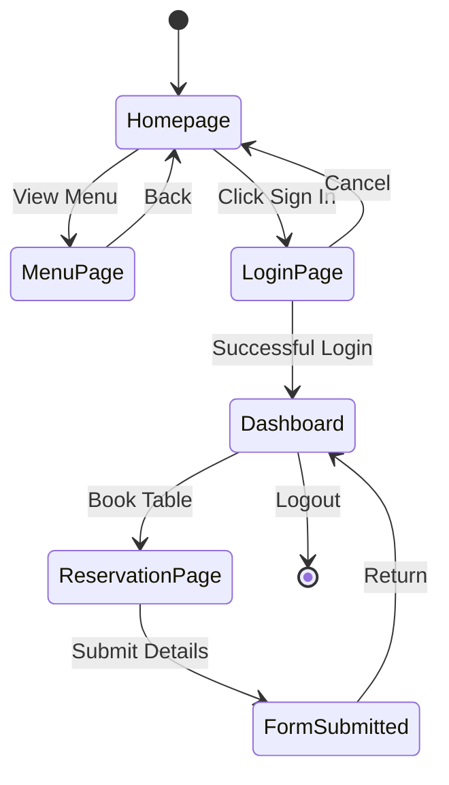
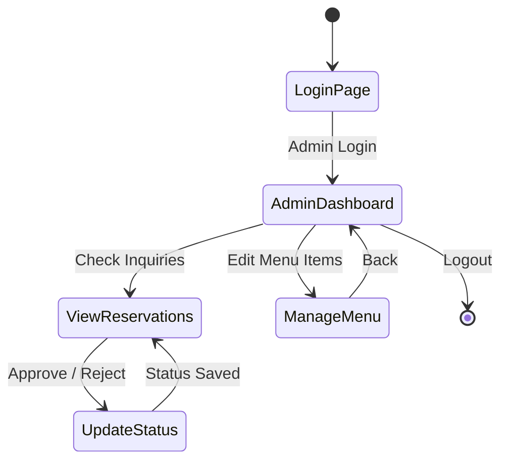

# Urban Spoon — User Workflows

This document outlines the operational workflows and states for both Customers and Administrators.

## Customer Workflow

```mermaid
stateDiagram-v2
    [*] --> Homepage
    
    Homepage --> MenuPage : View Menu
    MenuPage --> Homepage : Back
    
    Homepage --> LoginPage : Click Sign In
    LoginPage --> Dashboard : Successful Login
    LoginPage --> Homepage : Cancel
    
    Dashboard --> ReservationPage : Book Table
    ReservationPage --> FormSubmitted : Submit Details
    FormSubmitted --> Dashboard : Return
    
    Dashboard --> [*] : Logout
```

## Admin Workflow

```mermaid
stateDiagram-v2
    [*] --> LoginPage
    LoginPage --> AdminDashboard : Admin Login
    
    AdminDashboard --> ViewReservations : Check Inquiries
    ViewReservations --> UpdateStatus : Approve / Reject
    UpdateStatus --> ViewReservations : Status Saved
    
    AdminDashboard --> ManageMenu : Edit Menu Items
    ManageMenu --> AdminDashboard : Back
    
    AdminDashboard --> [*] : Logout
```
